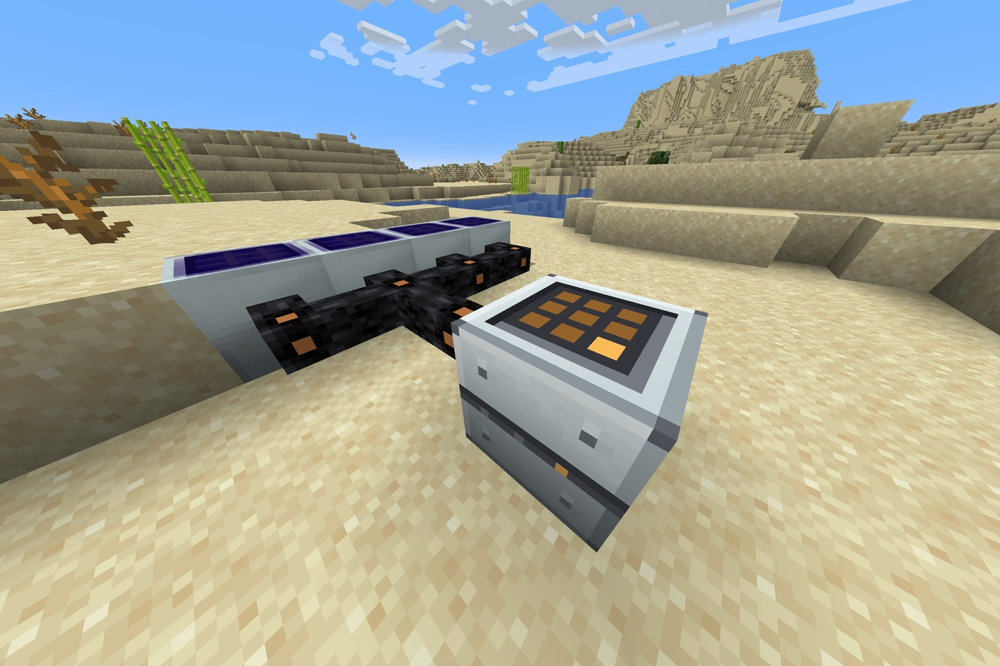
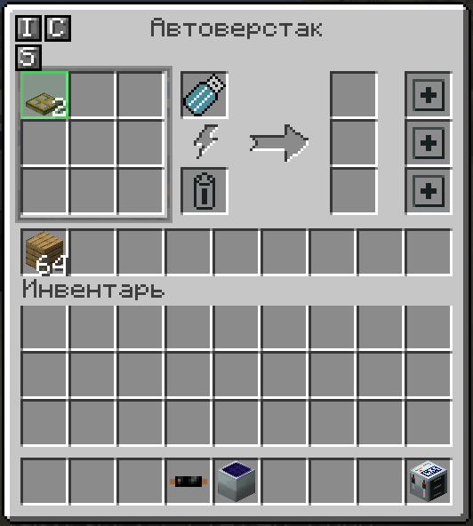

# IC2C Auto Crafter


[](https://www.curseforge.com/minecraft/mc-mods/ic2c-auto-crafter)


[](https://www.curseforge.com/minecraft/mc-mods/ic2-classic)

An **IndustrialCraft 2 Classic** addon for Minecraft 1.19.2 (Forge) that adds a single machine: the
**Auto Crafter**. It does not invent its own recipe editor — it runs the crafting recipes you already
stored on IC2's **Memory Stick** with an Industrial Worktable.

The mod registers through IC2's own plugin API (`@IC2Plugin`), extends IC2's machine classes and uses
IC2's GUI engine, so it behaves like a stock IC2 machine: EU, upgrades, wrench, comparators, slot side
configuration, The One Probe.

<p>
  
  
</p>

## How it works

1. Save recipes onto a Memory Stick at an **Industrial Worktable**.
2. Place the Auto Crafter and give it MV power (up to 128 EU/t).
3. Insert the stick — the nine recipe icons light up in the left panel. Click one to switch it off.
4. Fill the ingredient buffer (9 slots) by hand, hopper, tube or an IC2 Import Upgrade.
5. Take the results from the three output slots, or let an Export Upgrade push them out.

One operation crafts exactly one recipe, cycling through the enabled ones so nothing starves.

## Balance

| | Batch Crafter (IC2 Exp) | **Auto Crafter** | Bulk Crafter (IC2C) |
|---|---|---|---|
| Tier | LV, 32 EU/t | **MV, 128 EU/t** | EV, 2048 EU/t |
| Draw | 2 EU/t | **8 EU/t** | 25 EU per craft |
| Throughput | one recipe | **one craft per 5 s, 9 recipes in memory** | up to 64 crafts per tick |

800 EU per craft is exactly one macerator operation, which makes the cost easy to reason about.
Overclockers scale it the usual IC2 way.

Recipe: Advanced Machine Block + 2x Advanced Circuit + Electronic Circuit + Crafting Table.

## Why medium voltage

The IC2 team pushed back on autocrafting for years, and this addon is built to fit that reasoning
rather than ignore it:

* **Aroma1997** (IC² dev): *"there will not be a dedicated machine for just auto-crafting crafting
  recipes"*, and *"An autocrafting table is nothing we want to have, but a little crafting table, that
  makes crafting less complex is something completely different."*
* **Speiger** (IC2 Classic dev): the idea is sound but *"useless nowdays"* — *"There are no modpacks
  under 30 mods out there... its pretty much unlikly to miss a modpack without an autocrafter."*
* **Reoseah**: EnderIO and RFTools already ship cheaper, easier autocrafters, so an IC2 one would be
  ignored.

The same principle is written into the mod itself — the IC2C wiki on the Industrial Worktable: *"It is
designed to reduce crafting, by assisting you, not by automating it away."*

Hence the constraints here: recipes are authored by hand on the worktable, one craft per operation,
and an MV gate that lands the machine after transformers and advanced circuits, far below the
endgame Bulk Crafter.

Sources: [Industrial Assembler thread](https://forum.industrial-craft.net/thread/13140-industrial-assembler/) ·
[Electric Crafting table thread](https://forum.industrial-craft.net/thread/13199-electric-crafting-table/) ·
[Batch Crafter wiki](https://wiki.industrial-craft.net/index.php?title=Batch_Crafter)

## Features

* Runs up to nine recipes from one Memory Stick, round robin.
* Any recipe can be switched off with a click; the active one is framed, disabled ones are dimmed.
* Hovering the progress arrow explains why the machine is idle, and names the missing ingredient.
* The ingredient buffer only accepts items the loaded recipes actually need, so pipes cannot clog it.
* Craft leftovers (buckets and the like) go back to the buffer if they are ingredients, otherwise to
  the output.
* Full IC2 upgrade support, including Overclockers, Transformer, Energy Storage, Redstone and
  Import/Export.
* Custom sound (a seamless two second loop plus start and interrupt cues) and an animated face.
* 16 languages: en, ru, uk, be, sr, pl, cs, de, fr, es, pt-br, el, tr, zh-cn, ja, ko.

## Requirements

* Minecraft 1.19.2, Forge 43+
* IC2 Classic 1.19.2-2.1.3.0 or newer
* CarbonConfig 2.0.0 or newer (IC2 Classic 2.1.3.3+ already depends on it; with older IC2 Classic
  builds install it separately)

## Configuration

`config/ic2c/ic2c_autocrafter.cfg`, editable in game through CarbonConfig:

```ini
[auto_crafter]
  I:energyPerTick=8      # EU per tick while crafting
  I:ticksPerCraft=100    # 20 ticks = 1 second
  I:energyBuffer=4000    # internal EU buffer
  B:machineSound=true    # working loop
```

## Building

Java 17 is required. The two dependency jars are **not** in this repository — they belong to their
authors. Download them and drop them into `libs/`:

* `IC2Classic-1.19.2-2.1.3.4.jar`
* `CarbonConfig-1.19.2-2.0.2.jar`

Then:

```bash
./gradlew build            # -> build/libs/ic2c_autocrafter-1.19.2-<version>.jar
./gradlew runGameTestServer  # headless behaviour tests
```

## License

[MIT](LICENSE), covering the code and every asset in the jar: textures, GUI, sounds and logo. The
bottom face of the machine uses IC2 Classic's own texture by reference, so nothing from IC2 Classic
is shipped. Modpacks are welcome to include this mod, no permission needed.
